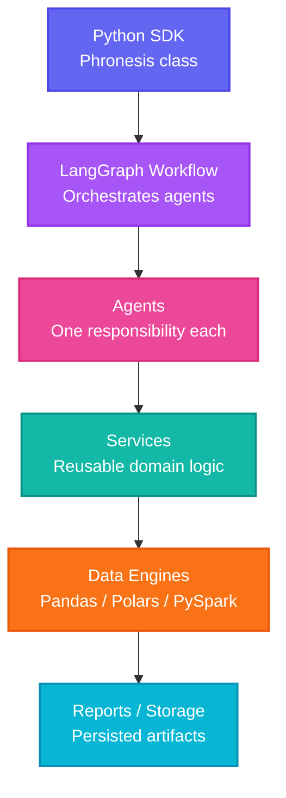
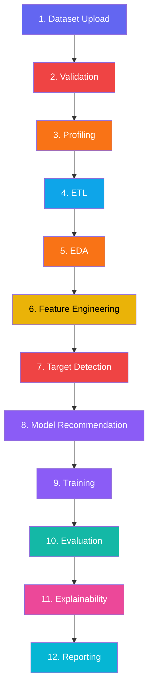
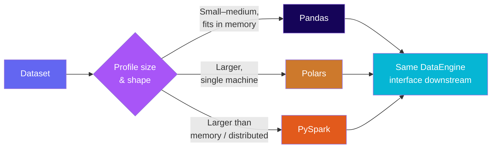

<div align="center">


<h3>
  
</h3>

<a href="https://pypi.org/project/phronesisml">
  
</a>
<a href="https://github.com/kartik00052/PhronesisML/actions/workflows/ci.yml">
  
</a>
<a href="https://github.com/kartik00052/PhronesisML/blob/main/LICENSE">
  
</a>
<a href="https://www.python.org/downloads/">
  
</a>
<a href="https://github.com/kartik00052/PhronesisML/stargazers">
  
</a>
<a href="https://github.com/kartik00052/PhronesisML/pulls">
  
</a>

<p>
  <a href="#why-phronesisml">Why</a> ·
  <a href="#installation">Install</a> ·
  <a href="#quick-start">Quick Start</a> ·
  <a href="#architecture-overview">Architecture</a> ·
  <a href="#sdk-interfaces">SDK</a> ·
  <a href="#contributing">Contributing</a>
</p>

</div>

---

## Table of Contents

<details open>
<summary><strong>Navigation</strong></summary>

1. [Why PhronesisML](#why-phronesisml)
2. [Core Principles](#core-principles)
3. [Key Features](#key-features)
4. [Architecture Overview](#architecture-overview)
5. [How It Works](#how-it-works)
6. [Engine Selection Logic](#engine-selection-logic)
7. [Technology Stack](#technology-stack)
8. [Performance](#performance)
9. [Installation](#installation)
10. [Quick Start](#quick-start)
11. [Examples](#examples)
12. [SDK Interfaces](#sdk-interfaces)
13. [Project Structure](#project-structure)
14. [Offline-First Philosophy](#offline-first-philosophy)
15. [Security](#security)
16. [Roadmap](#roadmap)
17. [Contributing](#contributing)
18. [Community](#community)
19. [FAQ](#faq)
20. [License](#license)
21. [Acknowledgements](#acknowledgements)

</details>

---

## Why PhronesisML

<div align="center">

| | Notebooks | AutoML Tools | **PhronesisML** |
|:---|:---:|:---:|:---:|
| Structure | Ad hoc, cell-by-cell | Fixed, opaque | **Modular agents on typed `WorkflowState`** |
| Transparency | High, but unorganized | Low — black box | **High — every decision is inspectable** |
| Overridable | N/A | Rarely | **Yes — imputation, encoding, model choice** |
| Reusable | Low | Low | **High — same pipeline, swap the data** |
| Production-ready | No | Partially | **Yes — versioned, reportable artifacts** |
| Works offline | Yes | Rarely | **Yes — by design** |

</div>

> **In short:** PhronesisML recommends; it does not obscure. Every stage of the pipeline is a discrete, testable, reusable unit of code operating on a shared, typed `WorkflowState`.

PhronesisML is **SDK-first** — the CLI, the FastAPI service, and any future GUI are thin clients built on the same SDK a data scientist would `import` directly. There is exactly **one source of truth** for ML logic.

---

## Core Principles

PhronesisML is built around five commitments that shape every design decision in the codebase:

| Principle | What It Means in Practice |
|---|---|
| **Simple API** | `Phronesis("data.csv").run()` is a complete, working pipeline. Complexity is opt-in, not mandatory. |
| **Advanced Power** | The same SDK exposes stage-by-stage control, custom configuration, and low-level workflow access when you need it. |
| **Offline-First** | The core pipeline runs with no network dependency — your data never has to leave your machine to be analyzed. |
| **Production-Ready** | Every run produces versioned, structured artifacts, not a throwaway notebook cell. |
| **Intelligent Automation** | Engine selection, target detection, and model recommendation are automated but always inspectable and overridable. |

---

## Key Features

<div align="center">

<table>
<tr>
<td align="center" width="110"><br/><sub>Multi-Agent</sub></td>
<td align="center" width="110"><br/><sub>Orchestration</sub></td>
<td align="center" width="110"><br/><sub>Auto Engine</sub></td>
<td align="center" width="110"><br/><sub>Cleaning</sub></td>
<td align="center" width="110"><br/><sub>Analysis</sub></td>
<td align="center" width="110"><br/><sub>Engineering</sub></td>
</tr>
<tr>
<td align="center" width="110"><br/><sub>Detection</sub></td>
<td align="center" width="110"><br/><sub>Selection</sub></td>
<td align="center" width="110"><br/><sub>Metrics</sub></td>
<td align="center" width="110"><br/><sub>Explainability</sub></td>
<td align="center" width="110"><br/><sub>Reporting</sub></td>
<td align="center" width="110"><br/><sub>Extensible</sub></td>
</tr>
</table>

</div>

| Feature | Description | Status |
|---|---|:---:|
| **Multi-Agent Workflow** | Each pipeline stage is an independent agent with a single responsibility | ✅ |
| **LangGraph Orchestration** | Agents are nodes in a directed graph; state passing, retries | ✅ |
| **Automatic Engine Selection** | Dataset size determines Pandas, Polars, or PySpark | ✅ |
| **ETL** | Declarative extraction, cleaning, and transformation | ✅ |
| **Validation** | Schema, type, and quality validation before downstream processing | ✅ |
| **EDA** | Automated statistical profiling and structured dataset summaries | ✅ |
| **Feature Engineering** | Automated and configurable transformation, encoding, derivation | ✅ |
| **Target Detection** | Heuristic, overridable identification of prediction target | ✅ |
| **Model Recommendation** | Rule- and metric-driven suggestion of candidate model families | ✅ |
| **Explainability** | Post-training feature importance and model-behavior summaries | ✅ |
| **Reporting** | Structured, versionable output artifacts for every stage | ✅ |
| **FastAPI Interface** | REST API with file upload, background jobs, OpenAPI docs | ✅ |
| **Offline-First** | Core pipeline stages run without network access | ✅ |
| **SDK-First** | Every interface is a client of the SDK | ✅ |
| **Plugin System** | Extension points for custom agents, models, engines, storage | 🔜 Planned |

---

## Architecture Overview



| Layer | Responsibility | Depends On |
|---|---|---|
| **Python SDK** | Single public entry point (`Phronesis` class) | — |
| **LangGraph Workflow** | Pipeline as graph; owns `WorkflowState` | Called by SDK |
| **Agents** | One pipeline responsibility each; read/write state | Graph nodes |
| **Services** | Stateless, reusable domain logic | Called by agents |
| **Data Engines** | Pandas, Polars, PySpark implementations | Called by services |
| **Reports / Storage** | Persists run artifacts | Written to by agents |

### Design Principles

| Principle | What It Means |
|---|---|
| **SDK-first** | One source of truth for ML logic |
| **Offline-first** | Core pipeline runs without network |
| **Deterministic ML** | Same input + config = same output |
| **Dependency Injection** | Agents receive dependencies rather than construct them |
| **Clean Architecture** | Layers depend inward, never outward |
| **Single Responsibility** | One agent, one job |
| **Strategy Pattern** | Interchangeable engine selection |

---

## How It Works



Each numbered stage is implemented as its own agent — see [Project Structure](#project-structure) for where each one lives in the codebase.

---

## Engine Selection Logic

PhronesisML supports three interchangeable dataframe backends behind a single `DataEngine` interface, so pipeline code never imports Pandas, Polars, or PySpark directly.



| Engine | Best For | Why |
|---|---|---|
| **Pandas** | Small-to-medium, in-memory | Ubiquitous, well understood |
| **Polars** | Larger single-machine workloads | Rust-based, multi-threaded query engine |
| **PySpark** | Distributed / larger-than-memory data | Industry standard at scale |

Selection is automatic by default but can always be forced explicitly — see [Quick Start](#quick-start).

---

## Technology Stack

<div align="center">


</div>

---

## Performance

PhronesisML's engine abstraction exists specifically so the pipeline can move from Pandas to Polars to PySpark as data size grows, without changing pipeline code. Formal, reproducible benchmarks across dataset sizes and engines are not yet published — this section will be filled in with measured numbers (not estimates) once a benchmark suite lands. Track progress in [Roadmap](#roadmap).

---

## Installation

### Standard (recommended)

```bash
pip install phronesisml
```

### Supported file formats

| Format | Supported | Dependency |
|---|:---:|---|
| CSV / TSV | ✅ | `pandas` (core) |
| Excel (.xlsx) | ✅ | `openpyxl` (core) |
| Parquet | ✅ | `pyarrow` (core) |
| JSON / JSONL | ✅ | `pandas` (core) |
| Feather / Arrow | ✅ | `pyarrow` (core) |

### Optional extras

| Extra | Install | What it adds |
|---|---|---|
| `all` | `pip install phronesisml[all]` | Everything below |
| `api` | `pip install phronesisml[api]` | FastAPI REST endpoints |
| `cli` | `pip install phronesisml[cli]` | CLI commands |
| `explain` | `pip install phronesisml[explain]` | SHAP explanations |
| `boost` | `pip install phronesisml[boost]` | XGBoost models |
| `mlflow` | `pip install phronesisml[mlflow]` | MLflow tracking |
| `spark` | `pip install phronesisml[spark]` | PySpark engine |
| `parquet` | `pip install phronesisml[parquet]` | Parquet support |
| `dev` | `pip install phronesisml[dev]` | pytest, ruff, mypy |

### From source

```bash
git clone https://github.com/kartik00052/PhronesisML.git
cd PhronesisML
python -m venv .venv
source .venv/bin/activate   # Windows: .venv\Scripts\activate
pip install -e ".[dev]"
```

---

## Quick Start

### SDK (Python)

```python
from phronesisml import Phronesis

ml = Phronesis("data/customers.csv")
ml.run()
print(ml.report())
```

### CLI

```bash
phronesisml run data/customers.csv
phronesisml run data/customers.csv --engine polars
phronesisml info
```

### FastAPI

```bash
pip install phronesisml[api]
uvicorn phronesisml.interfaces.api.app:app --reload
```

---

## Examples

<details open>
<summary><strong>Incremental Usage</strong></summary>

```python
from phronesisml import Phronesis

ml = Phronesis("data/customers.csv")
ml.load()
print(ml.summary())

ml.clean(null_strategy="fill")
ml.validate()
ml.eda()

ml.detect_target()
result = ml.train()
print(f"Best model: {result.model_type} ({result.score:.4f})")

print(ml.evaluate())
print(ml.explain())
```

</details>

<details>
<summary><strong>Simple API (one-liner functions)</strong></summary>

```python
from phronesisml import analyze, train

profile = analyze("data/customers.csv")
print(f"{profile.shape[0]} rows, {profile.shape[1]} columns")

result = train("data/customers.csv")
print(f"Best model: {result.best_model_type} ({result.best_score:.4f})")
```

</details>

<details>
<summary><strong>Async variants</strong></summary>

```python
from phronesisml import analyze_async, train_async
import asyncio

async def main():
    profile = await analyze_async("data/customers.csv")
    result = await train_async("data/customers.csv")

asyncio.run(main())
```

</details>

<details>
<summary><strong>Error handling</strong></summary>

```python
from phronesisml import train
from phronesisml.exceptions import DataValidationError, EngineSelectionError, WorkflowError

try:
    result = train("data/customers.csv")
except DataValidationError as e:
    print(f"Dataset failed validation: {e}")
except EngineSelectionError as e:
    print(f"Could not select a data engine: {e}")
except WorkflowError as e:
    print(f"Pipeline failed: {e}")
```

</details>

<details>
<summary><strong>Advanced — low-level workflow API</strong></summary>

```python
import asyncio
from phronesisml import run_pipeline

async def main():
    result = await run_pipeline(data_path="data/customers.csv")
    print(result)

asyncio.run(main())
```

</details>

---

## SDK Interfaces

PhronesisML is **SDK-first**: the CLI and FastAPI service are thin clients that call the same SDK you `import` directly.

| Interface | Install | Description |
|---|---|---|
| **Python SDK** | `pip install phronesisml` | `from phronesisml import Phronesis` |
| **CLI** | `pip install phronesisml[cli]` | `phronesisml run data.csv` |
| **FastAPI** | `pip install phronesisml[api]` | `uvicorn phronesisml.interfaces.api.app:app` |

---

## Project Structure

```
phronesisml/
  __init__.py          # Public SDK surface
  exceptions.py        # Exception hierarchy
  agents/              # Pipeline agents (11 total)
  configs/             # Pydantic configuration
  data/                # Data loading, validation, profiling
  engines/             # Pandas/Polars/Spark abstraction
  interfaces/           # CLI (Typer) + FastAPI
  ml/                   # Model definitions, training, metrics
  rag/                   # RAG infrastructure
  workflow/             # LangGraph workflow orchestration
```

---

## Offline-First Philosophy

PhronesisML's core pipeline — validation, profiling, ETL, EDA, feature engineering, target detection, model recommendation, training, evaluation, explainability, and reporting — runs entirely on your machine, with no network dependency and no requirement to send data to a hosted service. Optional extras (`mlflow` for remote experiment tracking, future cloud storage backends) are opt-in additions on top of an offline-capable core, not a requirement for it.

---

## Security

- **No data leaves your machine** unless you explicitly configure a remote storage or tracking backend.
- **No hidden network calls** in the core pipeline — installation extras that do require network access (e.g. `mlflow`) are opt-in.
- **Dependency-pinned releases** to reduce supply-chain surface area.
- Found a security issue? Please open a private security advisory on GitHub rather than a public issue.

---

## Roadmap

<div align="center">


</div>

**Completed**
- [x] Core `WorkflowState` + LangGraph orchestration
- [x] All 11 pipeline agents
- [x] Pandas, Polars, PySpark engines with auto-selection
- [x] Local filesystem storage
- [x] CLI and FastAPI interfaces
- [x] HTML report generation
- [x] Full test suites

**Planned**
- [ ] Plugin system with entry-points discovery
- [ ] S3, GCS, Azure Blob storage backends
- [ ] DuckDB engine
- [ ] PDF report rendering
- [ ] Parallel/branching agent execution
- [ ] Reproducible benchmark suite (see [Performance](#performance))
- [ ] Desktop GUI client
- [ ] Human-in-the-loop checkpoints

---

## Contributing

<div align="center">


</div>

```bash
make check       # lint + typecheck + test
make format      # auto-fix formatting
make build        # build wheel + sdist
make docker      # build and run Docker image
```

New to the project? Look for issues labeled `good first issue`. Please open an issue before starting on a large change, so the design can be discussed first.

---

## Community

- **[GitHub Discussions](https://github.com/kartik00052/PhronesisML/discussions)** — design questions, ideas, and general Q&A
- **[Issues](https://github.com/kartik00052/PhronesisML/issues)** — bug reports and feature requests
- **[Pull Requests](https://github.com/kartik00052/PhronesisML/pulls)** — see what's currently in progress

---

## FAQ

<details>
<summary>Why not just use AutoML?</summary>

AutoML tools optimize for a leaderboard metric and hide their reasoning. PhronesisML makes every decision inspectable and overridable.

</details>

<details>
<summary>Why LangGraph?</summary>

LangGraph models workflows as a graph of stateful nodes with conditional edges — a direct map onto PhronesisML's pipeline shape.

</details>

<details>
<summary>Why Polars in addition to Pandas?</summary>

Polars' Rust-based, multi-threaded engine handles larger workloads significantly faster. PhronesisML upgrades automatically when warranted — see [Engine Selection Logic](#engine-selection-logic).

</details>

<details>
<summary>Can I run only part of the pipeline?</summary>

Yes — `run()` and `run_pipeline()` accept a `stages` parameter so you can run, for example, only validation and EDA.

</details>

<details>
<summary>Does PhronesisML require an internet connection?</summary>

No. The core pipeline is offline-first — see [Offline-First Philosophy](#offline-first-philosophy). Only optional extras like remote MLflow tracking require network access.

</details>

---

## License

Licensed under the MIT License — see [LICENSE](LICENSE) for the full text.

---

## Acknowledgements

<div align="center">


</div>

PhronesisML's design draws inspiration from the architectural patterns and developer experience established by these projects, without any affiliation with or endorsement from them.

---

<div align="center">

**Built with a commitment to transparent, inspectable machine learning pipelines.**

[](https://github.com/kartik00052/PhronesisML)
[](https://pypi.org/project/phronesisml/)

</div>
