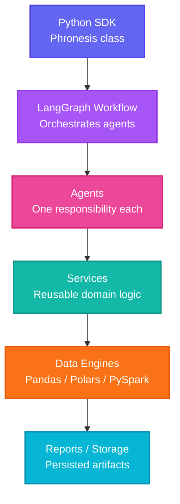
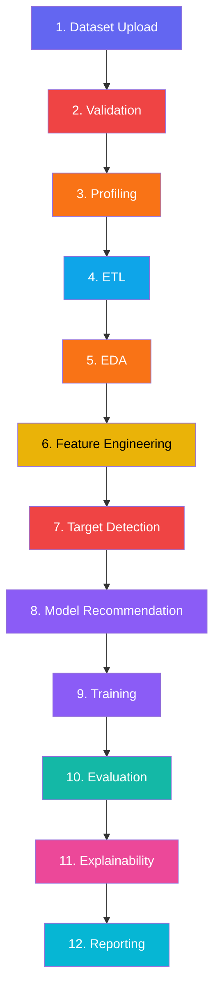

<div align="center">

<!-- Animated Hero Banner -->


<!-- Tagline with animated typing SVG -->
<h1>
  
</h1>

<!-- Badges Row 1: Status -->
<a href="https://pypi.org/project/phronesisml">
  
</a>
<a href="https://github.com/kartik00052/PhronesisML/actions/workflows/ci.yml">
  
</a>
<a href="https://github.com/kartik00052/PhronesisML/blob/main/LICENSE">
  
</a>
<a href="https://www.python.org/downloads/">
  
</a>

<!-- Badges Row 2: Community -->
<a href="https://github.com/kartik00052/PhronesisML/stargazers">
  
</a>
<a href="https://github.com/kartik00052/PhronesisML/network/members">
  
</a>
<a href="https://github.com/kartik00052/PhronesisML/issues">
  
</a>
<a href="https://github.com/kartik00052/PhronesisML/pulls">
  
</a>

<br/>

<!-- Quick Links as Pill Buttons -->
<p>
  <a href="#-why-phronesisml"></a>
  <a href="#-installation"></a>
  <a href="#-quick-start"></a>
  <a href="#-architecture-overview"></a>
  <a href="#-sdk-interfaces"></a>
  <a href="#-contributing"></a>
</p>

</div>

---

## Table of Contents

<details open>
<summary><strong>Navigation</strong></summary>

1. [Why PhronesisML](#-why-phronesisml)
2. [Key Features](#-key-features)
3. [Architecture Overview](#-architecture-overview)
4. [How It Works](#-how-it-works)
5. [Technology Stack](#-technology-stack)
6. [Installation](#-installation)
7. [Quick Start](#-quick-start)
8. [Examples](#-examples)
9. [SDK Interfaces](#-sdk-interfaces)
10. [Project Structure](#-project-structure)
11. [Roadmap](#-roadmap)
12. [Contributing](#-contributing)
13. [FAQ](#-faq)
14. [License](#-license)

</details>

---

## Why PhronesisML

<div align="center">

| | Notebooks | AutoML Tools | **PhronesisML** |
|:---:|:---:|:---:|:---:|
| Structure | Ad hoc, cell-by-cell | Fixed, opaque | **Modular agents on typed `WorkflowState`** |
| Transparency | High, unorganized | Low -- black box | **High -- every decision is inspectable** |
| Overridable | N/A | Rarely | **Yes -- imputation, encoding, model** |
| Reusable | Low | Low | **High -- same pipeline, swap the data** |
| Production | No | Partially | **Yes -- versioned artifacts** |

</div>

> **In short:** PhronesisML recommends; it does not obscure. Every stage of the pipeline is a discrete, testable, reusable unit of code operating on a shared, typed `WorkflowState`.

PhronesisML is **SDK-first** -- the CLI, the FastAPI service, and any future GUI are thin clients built on the same SDK a data scientist would `import` directly. There is exactly **one source of truth** for ML logic.

---

## Key Features

<div align="center">

<table>
<tr>
<td align="center" width="96"><br/><small>Multi-Agent</small></td>
<td align="center" width="96"><br/><small>Orchestration</small></td>
<td align="center" width="96"><br/><small>Auto Engine</small></td>
<td align="center" width="96"><br/><small>Cleaning</small></td>
<td align="center" width="96"><br/><small>Analysis</small></td>
<td align="center" width="96"><br/><small>Engineering</small></td>
</tr>
<tr>
<td align="center" width="96"><br/><small>Detection</small></td>
<td align="center" width="96"><br/><small>Selection</small></td>
<td align="center" width="96"><br/><small>Metrics</small></td>
<td align="center" width="96"><br/><small>Explainability</small></td>
<td align="center" width="96"><br/><small>Reporting</small></td>
<td align="center" width="96"><br/><small>Extensible</small></td>
</tr>
</table>

</div>

| Feature | Description | Status |
|---|---|:---:|
| **Multi-Agent Workflow** | Each pipeline stage is an independent agent with a single responsibility | &#9989; |
| **LangGraph Orchestration** | Agents are nodes in a directed graph; state passing, retries | &#9989; |
| **Automatic Engine Selection** | Dataset size determines Pandas, Polars, or PySpark | &#9989; |
| **ETL** | Declarative extraction, cleaning, and transformation | &#9989; |
| **Validation** | Schema, type, and quality validation before downstream processing | &#9989; |
| **EDA** | Automated statistical profiling and structured dataset summaries | &#9989; |
| **Feature Engineering** | Automated and configurable transformation, encoding, derivation | &#9989; |
| **Target Detection** | Heuristic, overridable identification of prediction target | &#9989; |
| **Model Recommendation** | Rule- and metric-driven suggestion of candidate model families | &#9989; |
| **Explainability** | Post-training feature importance and model-behavior summaries | &#9989; |
| **Reporting** | Structured, versionable output artifacts for every stage | &#9989; |
| **FastAPI Interface** | REST API with file upload, background jobs, OpenAPI docs | &#9989; |
| **Offline-First** | Core pipeline stages run without network access | &#9989; |
| **SDK-First** | Every interface is a client of the SDK | &#9989; |
| **Plugin System** | Extension points for custom agents, models, engines, storage | &#128312; |

---

## Architecture Overview

<div align="center">



</div>

| Layer | Responsibility | Depends On |
|---|---|---|
| **Python SDK** | Single public entry point (`Phronesis` class) | -- |
| **LangGraph Workflow** | Pipeline as graph; owns `WorkflowState` | Called by SDK |
| **Agents** | One pipeline responsibility each; read/write state | Graph nodes |
| **Services** | Stateless, reusable domain logic | Called by agents |
| **Data Engines** | Pandas, Polars, PySpark implementations | Called by services |
| **Reports / Storage** | Persists run artifacts | Written to by agents |

### Design Principles

| Principle | What It Means |
|---|---|
| **SDK-first** | One source of truth for ML logic |
| **Offline-first** | Core pipeline runs without network |
| **Deterministic ML** | Same input + config = same output |
| **DI** | Agents receive dependencies |
| **Clean Architecture** | Layers depend inward |
| **SRP** | One agent, one job |
| **Strategy Pattern** | Interchangeable engine selection |

### Data Engine Abstraction

| Engine | Best For | Why |
|---|---|---|
| **Pandas** | Small-to-medium, in-memory | Ubiquitous, well understood |
| **Polars** | Larger single-machine | Rust-based, multi-threaded |
| **PySpark** | Distributed / larger-than-memory | Industry standard at scale |

---

## How It Works

<div align="center">



</div>

---

## Technology Stack

<div align="center">


</div>

---

## Installation

### Standard (recommended)

```bash
pip install phronesisml
```

### What's included

| Format | Supported | Dependency |
|---|:---:|---|
| CSV / TSV | &#9989; | `pandas` (core) |
| Excel (.xlsx) | &#9989; | `openpyxl` (core) |
| Parquet | &#9989; | `pyarrow` (core) |
| JSON / JSONL | &#9989; | `pandas` (core) |
| Feather / Arrow | &#9989; | `pyarrow` (core) |

### With optional extras

| Extra | Install | What it adds |
|---|---|---|
| `all` | `pip install phronesisml[all]` | Everything below |
| `api` | `pip install phronesisml[api]` | FastAPI REST endpoints |
| `cli` | `pip install phronesisml[cli]` | CLI commands |
| `explain` | `pip install phronesisml[explain]` | SHAP explanations |
| `boost` | `pip install phronesisml[boost]` | XGBoost models |
| `mlflow` | `pip install phronesisml[mlflow]` | MLflow tracking |
| `spark` | `pip install phronesisml[spark]` | PySpark engine |
| `parquet` | `pip install phronesisml[parquet]` | Parquet support |
| `dev` | `pip install phronesisml[dev]` | pytest, ruff, mypy |

### From source

```bash
git clone https://github.com/kartik00052/PhronesisML.git
cd PhronesisML
python -m venv .venv
source .venv/bin/activate   # Windows: .venv\Scripts\activate
pip install -e ".[dev]"
```

---

## Quick Start

### SDK (Python)

```python
from phronesisml import Phronesis

ml = Phronesis("data/customers.csv")
ml.run()
print(ml.report())
```

### CLI

```bash
phronesisml run data/customers.csv
phronesisml run data/customers.csv --engine polars
phronesisml info
```

### FastAPI

```bash
pip install phronesisml[api]
uvicorn phronesisml.interfaces.api.app:app --reload
```

---

## Examples

<details open>
<summary><strong>Incremental Usage</strong></summary>

```python
from phronesisml import Phronesis

ml = Phronesis("data/customers.csv")
ml.load()
print(ml.summary())

ml.clean(null_strategy="fill")
ml.validate()
ml.eda()

ml.detect_target()
result = ml.train()
print(f"Best model: {result.model_type} ({result.score:.4f})")

print(ml.evaluate())
print(ml.explain())
```

</details>

<details>
<summary><strong>Simple API (One-Liner Functions)</strong></summary>

```python
from phronesisml import analyze, train

profile = analyze("data/customers.csv")
print(f"{profile.shape[0]} rows, {profile.shape[1]} columns")

result = train("data/customers.csv")
print(f"Best model: {result.best_model_type} ({result.best_score:.4f})")
```

</details>

<details>
<summary><strong>Async Variants</strong></summary>

```python
from phronesisml import analyze_async, train_async
import asyncio

async def main():
    profile = await analyze_async("data/customers.csv")
    result = await train_async("data/customers.csv")

asyncio.run(main())
```

</details>

<details>
<summary><strong>Error Handling</strong></summary>

```python
from phronesisml import train
from phronesisml.exceptions import DataValidationError, EngineSelectionError, WorkflowError

try:
    result = train("data/customers.csv")
except DataValidationError as e:
    print(f"Dataset failed validation: {e}")
except EngineSelectionError as e:
    print(f"Could not select a data engine: {e}")
except WorkflowError as e:
    print(f"Pipeline failed: {e}")
```

</details>

<details>
<summary><strong>Advanced -- Low-Level Workflow API</strong></summary>

```python
import asyncio
from phronesisml import run_pipeline

async def main():
    result = await run_pipeline(data_path="data/customers.csv")
    print(result)

asyncio.run(main())
```

</details>

---

## SDK Interfaces

PhronesisML is **SDK-first**: the CLI and FastAPI service are thin clients that call the same SDK you `import` directly.

| Interface | Install | Description |
|---|---|---|
| **Python SDK** | `pip install phronesisml` | `from phronesisml import Phronesis` |
| **CLI** | `pip install phronesisml[cli]` | `phronesisml run data.csv` |
| **FastAPI** | `pip install phronesisml[api]` | `uvicorn phronesisml.interfaces.api.app:app` |

---

## Project Structure

```
phronesisml/
  __init__.py          # Public SDK surface
  exceptions.py        # Exception hierarchy
  agents/              # Pipeline agents (11 total)
  configs/             # Pydantic configuration
  data/                # Data loading, validation, profiling
  engines/             # Pandas/Polars/Spark abstraction
  interfaces/          # CLI (Typer) + FastAPI
  ml/                  # Model definitions, training, metrics
  rag/                 # RAG infrastructure
  workflow/            # LangGraph workflow orchestration
```

---

## Roadmap

<div align="center">


</div>

**Completed**
- [x] Core `WorkflowState` + LangGraph orchestration
- [x] All 11 pipeline agents
- [x] Pandas, Polars, PySpark engines with auto-selection
- [x] Local filesystem storage
- [x] CLI and FastAPI interfaces
- [x] HTML report generation
- [x] Full test suites

**Planned**
- [ ] Plugin system with entry-points discovery
- [ ] S3, GCS, Azure Blob storage backends
- [ ] DuckDB engine
- [ ] PDF report rendering
- [ ] Parallel/branching agent execution
- [ ] Desktop GUI client
- [ ] Human-in-the-loop checkpoints

---

## Contributing

<div align="center">


</div>

```bash
make check       # lint + typecheck + test
make format      # auto-fix formatting
make build       # build wheel + sdist
make docker      # build and run Docker image
```

---

## FAQ

<details>
<summary>Why not just use AutoML?</summary>

AutoML tools optimize for a leaderboard metric and hide their reasoning. PhronesisML makes every decision inspectable and overridable.

</details>

<details>
<summary>Why LangGraph?</summary>

LangGraph models workflows as a graph of stateful nodes with conditional edges -- a direct map onto PhronesisML's pipeline shape.

</details>

<details>
<summary>Why Polars in addition to Pandas?</summary>

Polars' Rust-based, multi-threaded engine handles larger workloads significantly faster. PhronesisML upgrades automatically when warranted.

</details>

<details>
<summary>Can I run only part of the pipeline?</summary>

Yes -- `run()` and `run_pipeline()` accept a `stages` parameter.

</details>

---

## License

Licensed under the MIT License -- see [LICENSE](LICENSE) for the full text.

---

## Acknowledgements

<div align="center">


</div>

---

<div align="center">

**Built with a commitment to transparent, inspectable machine learning pipelines.**

[](https://github.com/kartik00052/PhronesisML)
[](https://pypi.org/project/phronesisml/)

</div>
