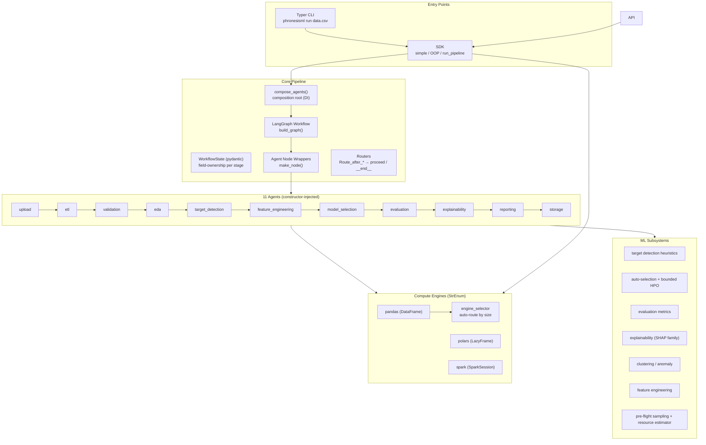
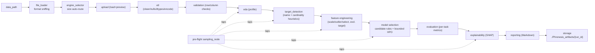
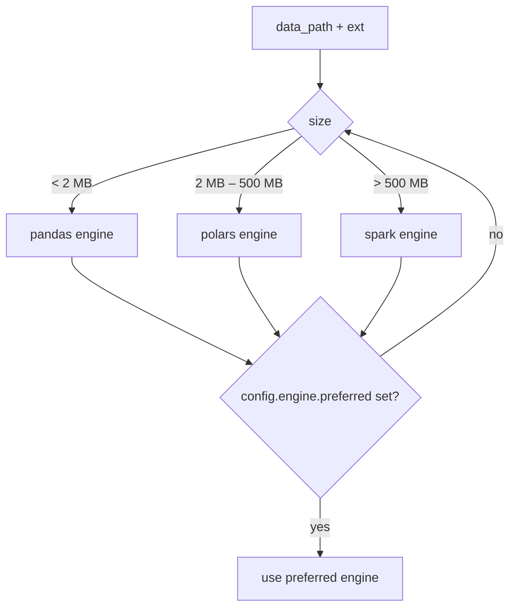

# PhronesisML — Project Knowledge Base

> **Role**: Principal Architect / ML Engineer / MLOps / Python Maintainer / Technical Writer / Open Source Maintainer
>
> **Scope**: Complete technical reference for the PhronesisML codebase, verified against the source tree.
> **Status**: Documentation-only deliverable. No source code was modified.

---

## Table of Contents

1. [Project Overview](#1-project-overview)
2. [Key Facts](#2-key-facts)
3. [High-Level Architecture](#3-high-level-architecture)
4. [Directory Structure](#4-directory-structure)
5. [Technology Stack & Dependencies](#5-technology-stack--dependencies)
6. [Core Data Flow](#6-core-data-flow)
7. [The 11-Stage Pipeline](#7-the-11-stage-pipeline)
8. [The 11 Agents](#8-the-11-agents)
9. [Compute Engines](#9-compute-engines)
10. [ML Subsystems](#10-ml-subsystems)
11. [Public API Surfaces](#11-public-api-surfaces)
12. [Workflow Orchestration (LangGraph)](#12-workflow-orchestration-langgraph)
13. [Services & Storage](#13-services--storage)
14. [Configuration System](#14-configuration-system)
15. [Pre-Flight Sampling & Resource Estimation](#15-pre-flight-sampling--resource-estimation)
16. [Testing](#16-testing)
17. [Benchmarks](#17-benchmarks)
18. [CI, Tooling & Packaging](#18-ci-tooling--packaging)
19. [Documentation & Docs Site](#19-documentation--docs-site)
20. [Security](#20-security)
21. [Contributing & Developer Workflow](#21-contributing--developer-workflow)
22. [Strengths](#22-strengths)
23. [Weaknesses & Known Limitations](#23-weaknesses--known-limitations)
24. [Roadmap & Planned Work](#24-roadmap--planned-work)
25. [Production Readiness Assessment](#25-production-readiness-assessment)
26. [Feature Capability Matrix](#26-feature-capability-matrix)
27. [Scorecard](#27-scorecard)

---

## 1. Project Overview

**PhronesisML** (pronounced *fron-ee-sis*, from Greek *φρόνησς* — practical wisdom/prudence) is an **auto-ML platform that automates the entire end-to-end machine-learning workflow** from raw data to an evaluated, explained model, plus an on-disk artifact suite. The project was originally named **AetherML** and was renamed to PhronesisML at version `0.2.0` (2026-07-13).

Its core promise: give a dataset path, get back a validated, analyzed, modeled, evaluated, and explained result with a human-readable Markdown report — without writing any ML code.

| Aspect | Value |
|---|---|
| **Name** | PhronesisML (`phronesisml`) |
| **Former name** | AetherML |
| **Current version** | `0.2.2` |
| **Latest release** | 2026-07-15 (`0.2.2` — mypy fixes, version bump, published to PyPI) |
| **Python support** | `>=3.12, <3.14` (CI runs 3.13) |
| **License** | MIT |
| **Source** | `https://github.com/kartik00052/PhronesisML` |
| **Author** | Kartik Sharma |
| **Primary interface** | Python SDK (`simple`, `OOP`, `advanced`) + CLI |
| **Orchestration** | LangGraph (`langgraph` graph runtime, state machine) |
| **ML backend** | scikit-learn |
| **Data engines** | pandas / polars / Spark (auto-selected by data size) |

---

## 2. Key Facts

- **Version**: `0.2.2` — hard-coded in `phronesisml/__init__.py:55`.
- **Rename**: AetherML → PhronesisML at `0.2.0` (2026-07-13). `CHANGELOG.md` tracks the history.
- **0.2.2 changelog**: fixed 7 mypy errors across `memory.py`, `sampler.py`, and a third file; version bump; PyPI publish.
- **Python floor**: `>=3.12` (uses `StrEnum`, `typing.Self`-era annotations, `from __future__ import annotations`).
- **Git history**: clean, conventional-commit style (`fix:`, `chore:`, `docs:`, `release:`, `style:`); every commit with a purpose (releases, mypy fixes, test cleanup, audit report updates).
- **Public surface**: 12 simple-API functions + `_async` variants, 11 OOP report types + `Phronesis` class, `run_pipeline` advanced API, Typer CLI.
- **Heavy imports are lazy**: `__getattr__` in `__init__.py` defers loading of `phronesisml.simple` and `phronesisml.sdk` until first use (keeps `import phronesisml` cheap — benchmarked at ~16 ms).

---

## 3. High-Level Architecture

PhronesisML is a **layered, dependency-injected, agent-based pipeline**:



**Key design decisions:**

1. **Manual dependency injection** — `phronesisml/agents/compose.py` is the composition root; every agent receives an `Engine` instance and a `PhronesisConfig`. No service locator, no global singletons.
2. **Agents are Protocols** — `BaseAgent` (in `agents/base.py`) is a structural Protocol; any object with the right methods is an agent. This keeps agents decoupled and individually testable.
3. **Stage field-ownership** — `WorkflowState` maps each state field to the stage that writes it (see `workflow/state.py`), making the data contract explicit.
4. **Thin API layers** — CLI and REST are thin adapters over the SDK. All business logic lives in agents/ML modules.
5. **Resource-bounded by design** — every potentially expensive operation carries a hard ceiling (see §15).

---

## 4. Directory Structure

```
PhronesisML/
├── .github/
│   └── workflows/
│       └── ci.yml                      # auto-format + lint + (further) jobs
├── .pre-commit-config.yaml             # ruff --fix + ruff-format + pre-commit-hooks
├── CHANGELOG.md
├── CODE_OF_CONDUCT.md                  # Contributor Covenant
├── CONTRIBUTING.md
├── LICENSE
├── Makefile                            # lint / format / typecheck / test / check / build / clean
├── README.md
├── SECURITY.md
├── benchmarks/
│   ├── baseline.json                   # recorded benchmark results (v0.2.x)
│   └── bench_baseline.py               # benchmark harness (median-of-runs + warmup)
├── docs/
│   ├── index.md  architecture.md  api.md  examples.md
│   ├── design-decisions.md  limitations.md  troubleshooting.md  getting-started.md
│   └── guides/
│       ├── simple-api.md  incremental.md  cli.md  advanced-api.md
├── mkdocs.yml                          # Material theme + mkdocstrings
├── pyproject.toml                      # build config, deps, entry points, tool configs
├── test_phronesis.py                   # root-level integration test (8 scenarios)
├── phronesisml/
│   ├── __init__.py                     # SDK surface, lazy imports, run_pipeline
│   ├── _stages.py                      # per-operation stage lists
│   ├── _result_builders.py
│   ├── configs/
│   │   └── settings.py                 # pydantic config (engine/data/sampling/explain/…)
│   ├── exceptions.py                   # full exception hierarchy
│   ├── simple.py                       # 12 simple-API functions + async
│   ├── sdk.py                          # OOP Phronesis class + report types
│   ├── results.py                      # dataclasses/pydantic result models
│   ├── agents/
│   │   ├── base.py                     # AgentResult, BaseAgent Protocol
│   │   ├── compose.py                  # composition root (11 agents)
│   │   └── <stage>/
│   │       ├── agent.py                # the agent itself
│   │       ├── schemas.py              # input/output schemas
│   │       └── system_prompts.py       # (reports) narrative/system prompts
│   ├── data/
│   │   ├── loaders/file_loader.py      # csv/parquet/json/excel/feather…
│   │   ├── transformers/cleaning.py    # null strategies, dtypes, encoding
│   │   ├── validators/checks.py        # row/column checks
│   │   └── profilers/stats.py          # dataset profiling
│   ├── engines/
│   │   ├── base_engine.py              # EngineType, BaseEngine ABC, collect cache
│   │   ├── engine_selector.py          # auto-route by size/extension
│   │   ├── pandas_engine.py
│   │   ├── polars_engine.py
│   │   └── spark_engine.py
│   ├── interfaces/
│   │   └── cli/app.py                  # Typer CLI
│   ├── ml/
│   │   ├── automl/{auto_selector.py,trainer.py}      # candidate selection + bounded HPO
│   │   ├── anomaly/detector.py                        # isolation_forest / lof
│   │   ├── clustering/algorithms.py                   # kmeans / dbscan / agglomerative
│   │   ├── evaluation/metrics.py                      # per-task metric sets
│   │   ├── explainability/{service.py,shap_explainer.py}
│   │   ├── feature_engineering/engineer.py
│   │   ├── preflight/{config.py,sampler.py,estimator.py}
│   │   ├── reports/{builder.py,templates/full_report.md}
│   │   └── target_detection/detector.py
│   ├── services/
│   │   ├── data_resolution.py         # path → resolved DataFrame
│   │   └── storage.py                 # save_artifacts to ./Phronesis_artifacts
│   └── workflow/
│       ├── graph.py  state.py  router.py  nodes.py  sampling_node.py
└── tests/
    ├── test_explainability.py
    └── test_preflight.py
```

---

## 5. Technology Stack & Dependencies

### Core dependencies (from `pyproject.toml`)
| Package | Role |
|---|---|
| `pandas` | default engine / DataFrames |
| `polars` | mid-size engine (LazyFrame) |
| `pyspark` | large-scale engine (SparkSession) |
| `scikit-learn` | all ML models, metrics, clustering, anomaly detection |
| `shap` | model explainability |
| `langgraph` | workflow graph orchestration |
| `pydantic` (v2) | config, state, schemas, results |
| `typer` | CLI |
| `jinja2` | report templating |
| `openpyxl` / `xlrd` | optional Excel readers |
| `pyarrow` | parquet/feather/arrow |
| `avro`, `orc` | optional file formats |
| `mlflow` | optional experiment tracking (graceful degradation) |

### Dev / tooling dependencies
`ruff` (lint+format), `mypy` (typecheck), `pytest` (tests), `build` (packaging), `mkdocs` + `mkdocstrings` (docs), `pre-commit` (hooks), `psutil` (optional memory measurement in benchmarks).

### Engine runtime requirements
- **Spark engine**: requires a JVM + `pyspark` distribution; `spark_master` default `local[*]`.

### Python version floor
`>=3.12, <3.14` (CI validates on 3.13). Uses `StrEnum`, modern generics, and `from __future__ import annotations` throughout.

---

## 6. Core Data Flow



- **Pre-flight sampling** (when enabled) runs before EDA/FeatureEngineering/TargetDetection/ModelSelection/Explainability, replacing the dataset with a stratified/smart sample while retaining full-dataset provenance in `sampling_metadata` (see §15).
- The pipeline is executed as a **LangGraph** state machine: each node wraps an agent, each agent returns a partial `WorkflowState` update; routers decide whether to continue or stop early (`Route_after_*` → `"proceed"` | `"__end__"`).

---

## 7. The 11-Stage Pipeline

| # | Stage | Input state fields | Produces |
|---|-------|--------------------|----------|
| 1 | `upload` | `data_path`, `raw_data` | `preview`, `data_format`, `row_count`, `column_count` |
| 2 | `etl` | `raw_data` | `processed_data`, `transform_log`, `data_format` |
| 3 | `validation` | `processed_data` | `validation_report`, `validated_data` |
| 4 | `eda` | `validated_data` | `data_profile` |
| 5 | `target_detection` | `validated_data` | `target_column`, `task_type`, `target_detection_confidence`, `ambiguity_reason` |
| 6 | `feature_engineering` | `validated_data`, `target_column` | `feature_names`, `feature_report`, engineered `X`/`y` |
| 7 | `model_selection` | engineered features | `best_pipeline` (`model_type`, `score`, `truncated`), HPO candidates |
| 8 | `evaluation` | `best_pipeline`, test split | `evaluation_report` (`metrics`, `ambiguity_caveat`) |
| 9 | `explainability` | model + data | `explanation_report` (`explainer_type`, `sampled`) |
| 10 | `reporting` | all upstream fields | `final_report` (Markdown) |
| 11 | `storage` | all upstream fields | artifact files under `./Phronesis_artifacts/{run_id}` |

### Stage lists (from `phronesisml/_stages.py`)
Each simple-API operation runs a prefix of the full pipeline:

| Operation | Stages |
|---|---|
| `clean` | upload, etl |
| `validate` | upload, etl, validation |
| `analyze` | upload, etl, validation, eda |
| `detect_task` | …+ target_detection |
| `detect_target` | …+ target_detection |
| `engineer` | …+ feature_engineering |
| `select_model` / `evaluate` | …+ model_selection, evaluation |
| `explain` | …+ explainability |
| `report` | …+ reporting |
| `cluster` / `detect_anomalies` | …+ evaluation, reporting (no explainability) |
| `train` | all 11 stages (incl. storage) |

---

## 8. The 11 Agents

All agents follow the same pattern: `BaseAgent` Protocol + `schemas.py` (pydantic in/out) + `agent.py`; injected via `compose_agents()` with `(engine, config, data_path)`.

### 8.1 Upload Agent (`agents/upload/`)
- Loads the file at `data_path` through `file_loader` → returns a raw DataFrame/LazyFrame.
- Enforces `DataConfig.max_file_size_bytes` (default **2 GB**).
- Excel: auto-selects the best (most populated) sheet; requires `openpyxl` (`.xlsx`) / `xlrd` (`.xls`).
- Records `data_format` (csv/parquet/json/excel/…), `row_count`, `column_count`, and a head `preview`.

### 8.2 ETL Agent (`agents/etl/`)
- **Null strategy** (`config.null_strategy`): `drop` | `fill` | `flag`.
- **Type casting** (`cast_dtypes`): coerces column types from a schema map.
- **Categorical encoding** (`encode_categoricals`): label-encodes every categorical column.
- Operates on **all** columns *before* target detection (this is the documented ETL vs Feature-Engineering distinction).
- Appends to `transform_log`; emits the cleaning used.

### 8.3 Validation Agent (`agents/validation/`)
- Runs `data/validators/checks.py` row/column checks.
- **Hard failures**: empty DataFrame or zero columns → raises `DataValidationError` (halts workflow).
- Soft warnings are collected into `validation_report` (`passed` flag, checks + messages).

### 8.4 EDA Agent (`agents/eda/`)
- Produces a full dataset profile via `data/profilers/stats.py`.
- `data_profile` includes `numeric_columns`, `categorical_columns`, missingness, dtypes, basic distributions.

### 8.5 Target Detection Agent (`agents/target_detection/`)
- Delegates to `ml/target_detection/detector.py` heuristics (see §10.1).
- Returns `target_column`, `task_type`, `target_detection_confidence`, and `ambiguity_reason` when confidence < `0.6` (`AMBIGUITY_THRESHOLD`).

### 8.6 Feature Engineering Agent (`agents/feature_engineering/`)
- Post-target-detection; **excludes the target column**.
- Variance filter (threshold `0.01`), correlation-based collinearity pruning, IQR outlier flagging, scaling.
- Produces `feature_names` + `feature_report`.

### 8.7 Model Selection Agent (`agents/model_selection/`)
- Rule-based candidate selection (3–5 models per task type) + bounded hyperparameter search.
- Honors `max_trials` (default **50**) and `max_time_seconds` (default **120**) — hard ceilings enforced in the trainer.
- `stratified` split for classification; `random` split for regression.
- Reports `best_pipeline` (`model_type`, `score`, `truncated`) where `truncated=True` signals HPO budget exhaustion.

### 8.8 Evaluation Agent (`agents/evaluation/`)
- Computes per-task metric sets via `ml/evaluation/metrics.py` (see §10.3).
- For ambiguous task types, evaluates **both** classification and regression and records an `ambiguity_caveat`.
- MLflow logging with **graceful degradation** (MLflow missing/disabled → logs a warning, continues).

### 8.9 Explainability Agent (`agents/explainability/`)
- Routes to an explainer via `_EXPLAINER_REGISTRY`: Tree → Linear → Permutation → Kernel (SHAP family).
- Deterministic sampling (`ExplainConfig.max_samples=100`, `max_features=50`).
- Structured failures: unsupported model/features → structured `error` field, not a crash.

### 8.10 Reporting Agent (`agents/reporting/`)
- Renders `ml/reports/templates/full_report.md` via Jinja2 (with `system_prompts.py` narrative blocks).
- Confirmed template sections: run id/status, summary, narrative, validation, EDA, target detection, feature engineering, model selection, evaluation, explainability, notes.

### 8.11 Storage Agent (`agents/storage/`)
- `services/storage.py::save_artifacts` writes to `./Phronesis_artifacts/{run_id}/`.
- Writes `evaluation.json`, the final Markdown report, and related artifacts; returns the artifact directory path.

---

## 9. Compute Engines



### `engine_selector.py`
- **Auto-routing thresholds**: `< 2 MB` → pandas; `2 MB – 500 MB` → polars; `> 500 MB` → spark. (Constants `_PANDAS_MAX`, `_DATA_EXTENSIONS`.)
- **Recognized extensions**: `.csv .parquet .json .jsonl .tsv .xlsx .xls .avro .orc` (+ feather/arrow via loader).
- **Size estimation**: `_estimate_file_size` walks files or stats directories.
- **Override**: `EngineConfig.preferred` (`"pandas" | "polars" | "spark"`) forces a choice; `spark_master` defaults to `local[*]`.

### `base_engine.py`
- `EngineType` is a `StrEnum` (`PANDAS / POLARS / SPARK`).
- `BaseEngine` ABC defines `collect()` / `lazy()` semantics.
- Per-id `_collect_cache` (`dict[int, pd.DataFrame]`): repeated `collect()` on the same frame is cached → **544× faster cached graph-compile reuse** in benchmarks (§17).

### Engine implementations
- `pandas_engine`: eager DataFrames; universal fallback.
- `polars_engine`: LazyFrame pipelines; `collect()` materializes.
- `spark_engine`: SparkSession-based; `lazy()` maps to Spark lazy evaluation.

---

## 10. ML Subsystems

### 10.1 Target Detection (`ml/target_detection/detector.py`)
Rule-based, deterministic heuristics (no ML model):

1. **Name signals**: `target`, `label`, `y`, `outcome`, `class`, `answer` → strong candidate.
2. **Categorical target with 2–50 unique values** → `classification`.
3. **Numeric target with 2–5 unique values** → `ambiguous` (`confidence < 0.6`, `ambiguity_reason` populated).
4. **Numeric target with >50 unique values** → `regression`.

`AMBIGUITY_THRESHOLD = 0.6` is documented in both `agents/target_detection/agent.py` and `detector.py` (the detector docstring carries a drift warning to keep them in sync).

### 10.2 AutoML (`ml/automl/`)
- `auto_selector.py`: rule-based candidate selection — 3–5 sklearn models per task type, each with a bounded parameter grid (`estimator_path`, parameter ranges).
- `trainer.py`: bounded HPO that **enforces** `max_trials=50` and `max_time_seconds=120`; records `truncated=True` when the budget is hit; returns the best pipeline.

### 10.3 Evaluation Metrics (`ml/evaluation/metrics.py`)
| Task type | Metric set |
|---|---|
| classification | accuracy, precision, recall, F1 (macro), confusion matrix |
| regression | RMSE, MAE, R² |
| clustering | silhouette, davies-bouldin, calinski-harabasz |
| anomaly detection | contamination ratio, anomaly count |
| ambiguous | both classification **and** regression + caveat |

### 10.4 Explainability (`ml/explainability/`)
- `service.py` is canonical. `shap_explainer.py` is **deprecated** → delegates to `service.py`.
- Routing: TreeExplainer → LinearExplainer → PermutationExplainer → KernelExplainer via `_EXPLAINER_REGISTRY`.
- Deterministic, seeded sampling; `ExplainConfig.max_samples=100`, `max_features=50`.

### 10.5 Feature Engineering (`ml/feature_engineering/engineer.py`)
Variance filter (`threshold=0.01`), correlation-based pruning, IQR outlier flagging, scaling.

### 10.6 Clustering (`ml/clustering/algorithms.py`)
- `run_clustering`: KMeans | DBSCAN | Agglomerative; `max_k=10` default; silhouette-based best result; returns `best_result` + `all_results`.

### 10.7 Anomaly Detection (`ml/anomaly/detector.py`)
- `detect_anomalies`: isolation_forest | lof; `contamination=0.1` default.
- **LOF cap**: 10,000 rows (larger datasets are sampled first).

### 10.8 Pre-Flight (`ml/preflight/`)
See §15.

---

## 11. Public API Surfaces

### 11.1 Simple API (`phronesisml.simple`)
23 functions, each with an `_async` twin:

`analyze`, `clean`, `validate`, `detect_target`, `detect_task`, `engineer`, `select_model`, `evaluate`, `explain`, `report`, `train`, `cluster`, `detect_anomalies`, `profile`, `predict`, `compare`, `save`, `restore`, `load`, `recommend`, `version`, `capabilities`, `health` (+ `_async`).

Return typed result objects: `DatasetProfile`, `CleanResult`, `ValidationResult`, `TargetResult`, `TaskDetectionResult`, `FeatureResult`, `ModelResult`, `TrainResult`, `ExplainResult`, `AnomalyResult`, `ClusteringResult`.

### 11.2 OOP API (`phronesisml.sdk`)
```python
from phronesisml import Phronesis
ml = Phronesis("data.csv")
ml.run()
print(ml.report())
```
Report types: `DatasetSummary`, `EDAReport`, `ValidationReport`, `TargetInfo`, `TaskInfo`, `FeatureReport`, `ModelInfo`, `EvaluationMetrics`, `ExplanationReport`, `AnomalyReport`, `ClusteringReport`.

### 11.3 Advanced API (`run_pipeline`)
```python
import phronesisml
result = await phronesisml.run_pipeline(data_path="data.csv")
```
- Parameters: `data_path`, `engine_preference`, `null_strategy`, `stages` (subset of 11), `config`, `sampling_config`.
- Returns a rich summary dict (row/column counts, target/task, best model + score, HPO truncation, evaluation metrics, explanation explainer type, sampling + resource metadata).
- Errors: `WorkflowError` (execution), `ConfigurationError` → wrapped as `WorkflowError`.

### 11.4 CLI (`interfaces/cli/app.py`)
13 commands: `run`, `info`, `version`, `capabilities`, `doctor`, `analyze`,
`validate`, `profile`, `train`, `evaluate`, `explain`, `report`, `compare`.

```
phronesisml run data.csv [--engine/-e pandas|polars|spark] [--nulls/-n drop|fill|flag] [--verbose/-v]
phronesisml info
phronesisml evaluate data.csv [--cv N] [--nulls/-n ...] [--engine/-e ...] [--verbose/-v]
phronesisml compare data.csv [-m model ...] [--cv N] [--nulls/-n ...] [--engine/-e ...]
```
Typer app with a RichHandler log handler.

*(Section 11.5 "REST API (`interfaces/api/`)" was removed in v0.3.0 along with the REST subsystem.)*

---

## 12. Workflow Orchestration (LangGraph)

### `workflow/graph.py`
- `build_graph(agents, stages, sampling_config, engine)` constructs a compiled LangGraph state machine.
- **Graph caching**: compiled graphs are cached by `(agent_names, stages)` — cached graph compile measured at ~4 µs vs ~2.2 ms cold (**544×**).
- Linear topologies for the requested stage lists; sampling node inserted before heavy stages.

### `workflow/state.py`
- `WorkflowState` (pydantic) with an explicit **field-ownership map** (`run_id→metadata`, `raw_data→upload`, `processed_data→etl`, …).
- Single source of truth for what each node may read/write.

### `workflow/router.py`
- `Route_after_*` routers return `"proceed"` or `"__end__"`; `build_graph` maps those tokens to real stage names.
- Contains a documented TODO list: feedback loops, parallel branching, per-stage skip logic, and conditional branches for classification vs regression.

### `workflow/nodes.py`
- `make_node(agent)` wraps an agent into a graph node:
  - `AgentError` → halts the workflow (fail-fast).
  - `AgentNotImplementedError` → returns an empty update (graceful skip).

### `workflow/sampling_node.py`
- Pre-flight sampling gate executed before EDA / FeatureEngineering / TargetDetection / ModelSelection / Explainability.
- `ResourceEstimator` results are cached into `resource_report`.

---

## 13. Services & Storage

### `services/data_resolution.py`
- Path/input → resolved DataFrame; handles file paths and inline data (used by API uploads and SDK).

### `services/storage.py`
- `save_artifacts(…, run_id)` → default `./Phronesis_artifacts/{run_id}/`.
- Writes `evaluation.json`, the final Markdown report, and supporting artifacts; returns the directory path.
- **Backends**: local filesystem only (S3/GCS/Azure are planned).

### `data/loaders/file_loader.py`
Formats: CSV/TSV, Parquet (`.pq`), JSON/JSONL/NDJSON, Feather/Arrow, Excel `.xlsx` (requires `openpyxl`) / `.xls` (requires `xlrd`).

### `data/transformers/cleaning.py`
Null strategies, dtype casting, categorical encoding (label-encoding).

### `data/validators/checks.py`
Row/column integrity checks (hard-fail on empty/zero-column).

### `data/profilers/stats.py`
Descriptive profile: dtypes, numeric/categorical column lists, missingness.

### `exceptions.py` — full hierarchy
```
PhronesisError (base)
├── ConfigurationError
├── DataError
│   ├── DataLoadError
│   ├── DataTransformError
│   └── DataValidationError
├── EngineError
│   └── EngineSelectionError
├── WorkflowError
└── AgentError
```

---

## 14. Configuration System

All settings are pydantic models in `configs/settings.py`; a `PhronesisConfig` bundles them.

| Config | Key knobs |
|---|---|
| `EngineConfig` | `preferred` (pandas/polars/spark), `spark_master` (default `local[*]`) |
| `DataConfig` | `default_format=auto`, `max_memory_bytes=500 MB`, `max_file_size_bytes=2 GB` |
| `SamplingConfig` | sampling mode, fraction, seed (see §15) |
| `ExplainConfig` | `max_samples=100`, `max_features=50` |
| `FeatureSelectionConfig` | variance/correlation thresholds, outlier config |
| `PhronesisConfig` | `null_strategy=drop`, engine/data/sampling/explain/feature sub-configs |

Exported surface includes `PhronesisConfig`, `SamplingConfig`, `FeatureSelectionConfig`, `ConfigurationError`.

---

## 15. Pre-Flight Sampling & Resource Estimation

Motivation: prevent OOM/overspend on huge datasets before expensive stages run.

### `ml/preflight/config.py` / `sampler.py`
- `SamplingMode` enum: `auto`, `random`, `stratified`, `time_aware`, `head`, `diversity`, `anomaly_preserving`, `text_balanced`, `disabled`.
- `SamplingMetadata` (frozen dataclass): `was_sampled`, `sampling_method`, `sampling_ratio`, `original_rows`, `sample_rows`, `seed`.

### `ml/preflight/estimator.py`
- `ResourceReport` (slots): `n_rows`, `n_cols`, `total_cells`, `estimated_memory_mb`, `estimated_encoded_features`, `estimated_encoded_memory_mb`, `estimated_train_test_memory_mb`, `estimated_shap_memory_mb`, `estimated_runtime_seconds`, `requires_sampling`, `recommended_sample_size`, `recommended_sample_fraction`, `sampling_reason`.
- The estimator drives whether sampling is required and by how much; the sampling node then replaces the dataset, with provenance retained in `sampling_metadata`.

---

## 16. Testing

| Suite | Location | Coverage |
|---|---|---|
| Unit: pre-flight | `tests/test_preflight.py` | sampler + resource estimator |
| Unit: explainability | `tests/test_explainability.py` | explainer routing + structured failures |
| Integration (8 scenarios) | root `test_phronesis.py` | end-to-end classification / regression / clustering on generated CSVs |

Root test conventions:
- `SAMPLE_ROWS = 1000`, RNG seed `42` (`np.random.default_rng(42)`).
- Generates classification / regression / clustering CSVs in a `tempfile.mkdtemp()`; cleans up.
- Filters sklearn user/future warnings for clean output.

Run: `pytest -q --tb=short` (Makefile `test` target).

---

## 17. Benchmarks

### Harness (`benchmarks/bench_baseline.py`)
- `_bench(...)`: runs a callable N times, discarding a warm-up iteration, reporting median.
- 5,000-row synthetic CSV; RNG seed `42`; optional psutil memory tracking.

### Recorded baseline (`benchmarks/baseline.json`, v0.2.x)
| Benchmark | Result |
|---|---|
| `import phronesisml` | **0.016 s** (lazy imports working as designed) |
| graph compile — cold | **0.0022 s** |
| graph compile — cached | **4e-06 s** (≈ **544×** faster via graph/state caching) |
| full pipeline | **9.02 s** |
| engine select small | pandas |
| engine select medium | polars |
| memory | **"N/A"** — psutil not installed in the benchmark environment (🟡 measurement is conditional) |

---

## 18. CI, Tooling & Packaging

### `pyproject.toml`
- Build backend + package metadata; console script entry point (`phronesisml` → CLI); optional extras: `api`, `dev`, `spark`, `docs`.
- Tool configs: `ruff` (lint/format), `mypy`, `pytest`, `build`.

### `Makefile`
| Target | Action |
|---|---|
| `lint` | `ruff check --no-fix` |
| `format` | `ruff format` |
| `typecheck` | `mypy --ignore-missing-imports` |
| `test` | `pytest -q --tb=short` |
| `check` | lint + typecheck + test |
| `build` | `python -m build` |
| `clean` | remove build artifacts |

### `.github/workflows/ci.yml`
- **auto-format job**: runs `ruff check --fix` + `ruff format` on PR/main; the bot commits `style: auto-format via Ruff`. Guarded by a commit-message-contains check to avoid bot loops.
- **lint job**: `ruff check --no-fix`.
- Permissions: `contents: write`, `packages: write`. Further jobs present (truncated in exploration).
- Python `3.13` (project floor).

### `.pre-commit-config.yaml`
- `ruff` v0.11.13 (`--fix`) + `ruff-format`
- `pre-commit-hooks` v4.6.0: `trailing-whitespace`, `end-of-file-fixer`, `check-yaml --unsafe`, `check-added-large-files` (max 10,000 KB)

### Docker (removed in v0.3.0)
The `Dockerfile`, `docker-compose.yml`, and `.dockerignore` served the REST-server
deployment and were removed with the REST subsystem in v0.3.0.

### MkDocs (`mkdocs.yml`)
- Material theme (`default`/`slate` schemes, `indigo`/`amber` palettes), `mkdocstrings` (google-style docstrings).
- Nav: Home / Getting Started / Architecture / API / guides / troubleshooting / limitations / design decisions.

---

## 19. Documentation & Docs Site

| Doc | Purpose |
|---|---|
| `../docs/index.md` | landing + quickstart |
| `../docs/getting-started.md` | install & first run |
| `../docs/architecture.md` | architecture overview (matches implementation) |
| `../docs/api.md` | SDK reference |
| `../docs/design-decisions.md` | rationale for key choices |
| `../docs/limitations.md` | known limitations (matches §23) |
| `../docs/troubleshooting.md` | FAQ / error resolution |
| `../docs/examples.md` | worked examples |
| `../docs/guides/simple-api.md` | simple-API walkthrough |
| `../docs/guides/incremental.md` | incremental / partial runs |
| `../docs/guides/cli.md` | CLI reference |
| `../docs/guides/advanced-api.md` | `run_pipeline` reference |

All docs were cross-checked against the implementation (stage tables ↔ `_stages.py`, CLI flags ↔ `cli/app.py`) and are consistent.

---

## 20. Security

Per `SECURITY.md` (and confirmed in code):

- **Supported versions**: `0.2.x`.
- **Reporting**: email `kartiksharma18852@gmail.com`.
- **Security posture**:
  - ✅ **No RCE** — no arbitrary code execution paths; models come from a fixed sklearn registry.
  - ✅ **No network exfiltration** — no outbound telemetry.
  - ✅ **Temp file cleanup** — uploaded/temp files are cleaned up.
  - ✅ **No credentials in code** — configuration carries no secrets; API keys are injected via env where needed.
- Dependency pinning via `pyproject.toml` extras; container runs as **non-root** user.

---

## 21. Contributing & Developer Workflow

Per `CONTRIBUTING.md`:

- **Setup**: `pip install -e ".[dev]"`, then `pre-commit install`.
- **Checks**: `ruff` (lint+format), `mypy`, `pytest` — all wrapped by Makefile `check`.
- **Branch strategy**: `main` (stable) + `feat/*`, `fix/*`, `docs/*` branches.
- **Commits**: conventional commits (enforced style used throughout history: `fix:`, `docs:`, `chore:`, `release:`, `style:`).
- **Community**: `CODE_OF_CONDUCT.md` = Contributor Covenant.

---

## 22. Strengths

1. **Complete auto-ML loop** — one path covers clean→profile→model→evaluate→explain→report→store. No manual wiring.
2. **Clean architecture** — constructor injection (composition root), agent Protocols, explicit state field-ownership, thin API layers. Highly testable.
3. **Engine abstraction done right** — pandas/polars/spark auto-routing by data size with graceful override and a cached `collect()` layer.
4. **Resource-responsible by design** — pre-flight sampling, `ResourceReport`, bounded HPO (`max_trials`, `max_time_seconds`), SHAP `max_samples`/`max_features` caps, LOF row cap, 2 GB upload ceiling.
5. **Fast startup & reuse** — lazy imports (16 ms import), cached graph compile (544×), cached engine collect.
6. **Deterministic and reproducible** — seeded RNG everywhere (sampling, HPO, explainability), rng=42 in tests/benchmarks.
7. **Honest about ambiguity** — `AMBIGUITY_THRESHOLD=0.6`, `ambiguity_reason`, dual evaluation for ambiguous tasks with explicit caveats.
8. **Graceful degradation** — MLflow optional, psutil optional, deprecated `shap_explainer` delegates cleanly, `AgentNotImplementedError` skips gracefully.
9. **Production plumbing** — Docker multi-stage non-root, healthchecks, compose restart policy, CI auto-format + lint, pre-commit, MkDocs, Makefile.
10. **Well-documented** — docs match implementation; security/contributing/code-of-conduct present; changelog disciplined.

---

## 23. Weaknesses & Known Limitations

Documented in `../docs/limitations.md` and confirmed against code. **✅ = docs match reality** (feature not implemented); **🟡 = partial**.

| # | Limitation | Status |
|---|---|---|
| 1 | **PDF reports** raise `NotImplementedError` — Markdown/HTML only | ✅ |
| 2 | **Time-series** not supported (no date-aware modeling) | ✅ |
| 3 | **Plugin system** not implemented | ✅ |
| 4 | **Storage backends** local-only; S3/GCS/Azure planned | ✅ |
| 5 | **API job store** is in-memory — jobs lost on restart | 🟡 (works, but ephemeral) |
| 6 | **Legacy `.xls`** requires optional `xlrd` | 🟡 (optional dep) |
| 7 | **GPU** not supported — CPU scikit-learn only | ✅ |
| 8 | **Memory benchmark** reports "N/A" without psutil | 🟡 (measurement conditional) |
| 9 | **Workflow graph** currently linear — TODO: feedback loops, parallel branches, per-stage skip, task-type conditional branching | ✅ (documented TODO) |
| 10 | **Target detection** is heuristic-only (no learned target recommendation) | ✅ (by design) |

Other observed trade-offs:
- **Two sources of truth for `AMBIGUITY_THRESHOLD=0.6`** (agent + detector) — mitigated by a drift warning in the detector docstring.
- **ETL encodes ALL categoricals pre-target-detection**, then feature engineering operates post-target-detection excluding the target — documented, but surprising if both are customized.
- Heavy dependencies (Spark, SHAP) make the base install large; handled via optional extras.

---

## 24. Roadmap & Planned Work

Derived from code TODOs, `../docs/limitations.md`, and repository intent (no external roadmap file exists):

1. **Non-linear workflows** — feedback loops, parallel branching, per-stage skip logic, conditional classification/regression branches (`workflow/router.py` TODO).
2. **Cloud storage backends** — S3 / GCS / Azure adapters for `save_artifacts`.
3. **Persistent job store** — replace in-memory `JobStore` (e.g., Redis/DB) for durable REST jobs.
4. **PDF report generation** — currently `NotImplementedError`.
5. **Time-series support** — date-aware target detection + forecasting candidates.
6. **GPU acceleration** — CUDA-backed training path.
7. **Plugin system** — user-supplied agents/models.
8. **Learned target recommendation** — move beyond heuristic target detection.
9. **psutil-aware memory benchmarks** — make `baseline.json` memory rows meaningful in CI.

---

## 25. Production Readiness Assessment

| Dimension | Grade | Notes |
|---|---|---|
| **Correctness** | 🟢 Strong | Unit + integration tests, deterministic seeds, graceful failure modes |
| **Observability** | 🟡 Moderate | Structured logs (Rich), run statuses; no tracing/metrics dashboards |
| **Scalability** | 🟡 Moderate | Engine routing to Spark covers large data; sampling mitigates cost |
| **Resilience** | 🟡 Moderate | Graceful degradation; no retry/backoff layer for long runs |
| **Security** | 🟢 Strong for scope | No RCE/exfiltration, no secrets in code, temp cleanup |
| **Operability** | 🟢 Strong | Makefile, CI auto-format, pre-commit |
| **Testing depth** | 🟡 Moderate | Good unit+integration coverage; no CI benchmark gate |
| **Documentation** | 🟢 Strong | Complete docs site, guides, changelog, security/contributing |

**Verdict**: Solid **experimental-to-beta** OSS auto-ML library. The core SDK path is production-grade in isolation; the CLI delegates to the SDK and inherits its reliability.

---

## 26. Feature Capability Matrix

Legend: ✅ Implemented · 🟡 Partial · 🔵 Experimental · 📄 Documented only · ❌ Planned

| Feature | Status | Notes |
|---|---|---|
| 11-stage pipeline | ✅ | upload→…→storage |
| Simple API (12 fns + async) | ✅ | `phronesisml.simple` |
| OOP SDK (`Phronesis`) | ✅ | `phronesisml.sdk` |
| Advanced API (`run_pipeline`) | ✅ | `phronesisml/__init__.py` |
| CLI | ✅ | Typer |
| Engine auto-routing (pandas/polars/spark) | ✅ | size thresholds |
| Engine `preferred` override | ✅ | `EngineConfig` |
| Cached engine collect | ✅ | `_collect_cache` |
| Pre-flight sampling | ✅ | 9 `SamplingMode`s |
| Resource estimation | ✅ | `ResourceReport` |
| Target detection heuristics | ✅ | name + cardinality |
| Task-type ambiguity handling | ✅ | threshold 0.6 + caveat |
| Feature engineering | ✅ | variance/corr/outlier/scale |
| Auto model selection | ✅ | rule-based + bounded HPO |
| Evaluation (4 metric sets) | ✅ | + ambiguous dual-eval |
| Explainability (SHAP) | ✅ | explainer routing |
| Clustering | ✅ | KMeans/DBSCAN/Agglom |
| Anomaly detection | ✅ | IF/LOF |
| Markdown report | ✅ | Jinja2 template |
| HTML report | ✅ | docs claim Markdown/HTML |
| **PDF report** | ❌ | `NotImplementedError` |
| Storage (local) | ✅ | `./Phronesis_artifacts/{run_id}` |
| **Storage (S3/GCS/Azure)** | ❌ | planned |
| MLflow tracking | 🟡 | graceful degradation |
| **GPU training** | ❌ | CPU only |
| **Time-series** | ❌ | planned |
| **Plugin system** | ❌ | planned |
| **Persistent job store** | ❌ | in-memory only |
| Legacy `.xls` | 🟡 | optional `xlrd` |
| Lazy imports / fast startup | ✅ | 16 ms import |
| Graph caching | ✅ | 544× compile speedup |
| psutil memory benchmark | 🟡 | conditional (N/A w/o psutil) |
| Docker / compose / healthcheck | ✅ | non-root, restart policy |
| CI auto-format + lint | ✅ | `ci.yml` |
| MkDocs site | ✅ | material + mkdocstrings |

---

## 27. Scorecard

| Category | Score (0–10) | Notes |
|---|---|---|
| Architecture & design | 9 | DI, protocols, state contracts, thin adapters |
| Code quality | 8 | typed, mypy-clean (0.2.2), ruff-enforced |
| Feature completeness | 7 | core loop complete; PDF/time-series/plugins pending |
| Testing | 6 | good coverage, room for API/CI-benchmark depth |
| Performance | 7 | fast startup/reuse; big-data via Spark but unmeasured end-to-end |
| Documentation | 9 | accurate, thorough, matches implementation |
| Security | 8 | strong posture for an OSS auto-ML lib |
| Operational maturity | 6 | containerized + healthchecked, but ephemeral job store |
| Extensibility | 7 | agent Protocols + plugins planned |
| **Overall** | **7.5 / 10** | Strong, well-architected auto-ML library at v0.2.2; the shortest path to an 8.5+ is a persistent job store, non-linear workflows, and deeper API/benchmark tests. |

---

*Generated from the PhronesisML source tree (v0.2.2), verified file-by-file. This knowledge base is a documentation artifact and was produced without modifying any source, tests, configuration, or infrastructure.*
